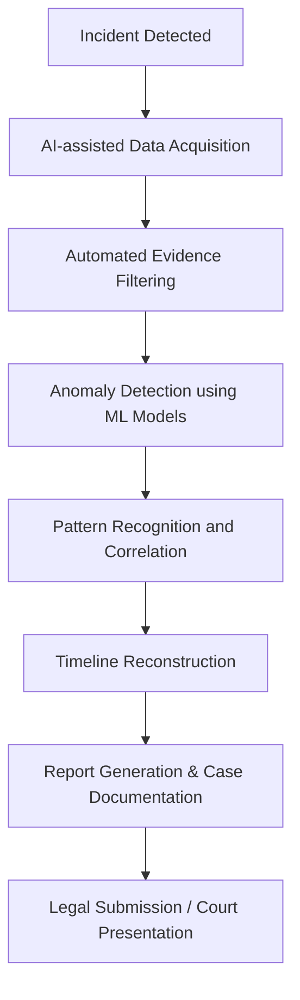

# The Role of Artificial Intelligence in Cyber Crime Investigation and Digital Forensics

**Author:** [Your Name]  
**Date:** October 2025  
**Course:** Cyber Crime Investigation & Digital Forensics  
**Self-Learning Based On:** TryHackMe – Web Fundamentals & Jr Penetration Tester

---

## Introduction

With the exponential growth of technology, cybercrime has become increasingly sophisticated and global. Investigators face new challenges in collecting, analyzing, and correlating vast amounts of digital evidence.  
To combat this, Artificial Intelligence (AI) and Machine Learning (ML) have emerged as powerful allies in Cyber Crime Investigation and Digital Forensics.

AI can automate repetitive forensic tasks, identify hidden patterns, detect anomalies, and even predict potential attacks. These capabilities not only accelerate investigations but also improve accuracy, enabling experts to focus on complex analytical and legal aspects.

---

## How AI Supports Cyber Crime Investigations

AI contributes to cyber investigations through several key areas:

### 1. Automated Evidence Collection

Digital forensic tools powered by AI can automatically scan systems, logs, and networks for evidence.  
Natural Language Processing (NLP) can even extract information from unstructured data such as chat logs or emails.

### 2. Anomaly and Intrusion Detection

AI algorithms, especially Machine Learning classifiers, help detect anomalies in traffic or user behavior.  
For example:

- Unusual login patterns
- Suspicious IP activity
- Abnormal data transfers

These are flagged by AI models, alerting investigators in real time.

### 3. Malware Classification

Using deep learning models such as Convolutional Neural Networks (CNNs), AI can classify malware families by analyzing binary patterns or opcode sequences — saving hours of manual analysis.

### 4. Digital Evidence Correlation

AI assists in correlating data from multiple sources — social media, network logs, financial records — to uncover links between suspects, devices, and activities.

### 5. Predictive Analysis

Predictive models can anticipate potential cyberattacks based on existing data trends.  
For instance, AI may forecast phishing campaigns or DDoS patterns before they fully evolve.

---

## AI in Digital Forensics Workflow

The integration of AI enhances each phase of the forensic process — from evidence acquisition to reporting.  
Below is a simplified flowchart describing how AI fits into a typical digital forensics investigation pipeline.

