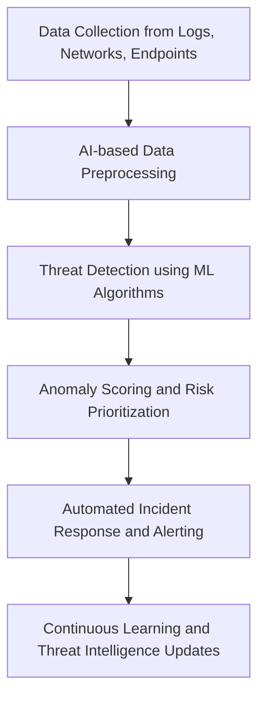

# Applications of Artificial Intelligence in Cyber Security

**Author:** [Your Name]  
**Date:** October 2025  
**Course:** Cyber Security and Practices  
**Activity:** Stage 1 – Self-Learning Assessment (MOOC)

---

## Introduction

Cybersecurity has become a critical concern in the digital era, where organizations depend heavily on interconnected systems, cloud computing, and mobile networks. With cyberattacks becoming more sophisticated and frequent, traditional defense mechanisms often fail to provide adequate protection.  
In response to this growing threat, **Artificial Intelligence (AI)** has emerged as a transformative force in cybersecurity. AI systems can process massive amounts of data, detect threats faster than humans, and automate responses to attacks — making them essential components of modern defense strategies.

This article explores the **applications, advantages, challenges, and future potential** of AI in cybersecurity, demonstrating how machine learning and intelligent automation are reshaping the field.

---

## Role of AI in Cyber Security

AI strengthens cybersecurity through proactive detection, adaptive learning, and real-time defense. It shifts security strategies from **reactive** (responding to attacks) to **predictive** (anticipating and preventing them).

Key contributions include:

### 1. Threat Detection and Analysis

AI-powered systems analyze network traffic and user behavior to identify suspicious patterns. Machine learning (ML) algorithms can detect anomalies, zero-day exploits, and malware by comparing activities against known baselines.

### 2. Automated Incident Response

AI tools enable automation of routine security tasks such as alert triage, log analysis, and patch management. This helps security teams focus on high-priority incidents while reducing human error and response times.

### 3. Predictive Intelligence

By learning from previous attack data, AI systems can predict potential vulnerabilities or attack surfaces before they are exploited. Predictive analytics assists in proactive mitigation.

### 4. Phishing and Email Security

Natural Language Processing (NLP) helps AI models identify phishing attempts by analyzing linguistic patterns, sender behavior, and embedded links. This reduces successful phishing incidents.

### 5. Malware Detection and Classification

AI can analyze millions of files to distinguish between benign and malicious code. Deep learning models can recognize malware families even when their code is obfuscated.

---

## AI-Driven Cyber Defense Workflow

The following flowchart illustrates how AI integrates into a cybersecurity workflow, from data collection to automated response.

**Explanation:**  
AI continuously learns from security events. Data from multiple sources is analyzed, threats are prioritized based on risk, and automated response mechanisms neutralize potential attacks.

---

## Common AI Techniques Used in Cyber Security

| Technique                         | Description                                | Application                                  |
| --------------------------------- | ------------------------------------------ | -------------------------------------------- |
| Machine Learning (ML)             | Algorithms that learn from historical data | Threat detection, anomaly identification     |
| Deep Learning (DL)                | Neural networks for pattern recognition    | Malware analysis, image-based authentication |
| Natural Language Processing (NLP) | Text and speech understanding              | Phishing detection, chat monitoring          |
| Reinforcement Learning            | Continuous feedback-based learning         | Adaptive intrusion prevention systems        |
| Fuzzy Logic                       | Handling uncertain data                    | Risk assessment and decision-making          |

---

## Real-World Applications

1. **SIEM Systems (Security Information and Event Management):**  
   Platforms like IBM QRadar and Splunk use AI for automated correlation and alert prioritization.

2. **Endpoint Protection:**  
   Solutions such as CrowdStrike Falcon and SentinelOne use behavioral AI to detect abnormal process execution and block malware in real time.

3. **Network Intrusion Detection:**  
   AI models identify deviations from normal network traffic, helping prevent data breaches and DDoS attacks.

4. **Fraud Detection:**  
   Financial institutions use ML algorithms to detect suspicious transactions instantly, reducing financial crime.

---

## Benefits of AI in Cyber Security

- **Speed and Scalability:** AI analyzes vast datasets faster than human analysts.
- **Accuracy:** Reduces false positives and improves threat prioritization.
- **Proactive Defense:** Predicts potential attacks before they occur.
- **Cost Efficiency:** Automates repetitive tasks and optimizes resource utilization.
- **Continuous Improvement:** AI systems learn from new data, adapting to emerging threats.

---

## Challenges and Limitations

Despite its advantages, AI introduces certain challenges:

- **Data Quality and Bias:** Inaccurate or biased data can mislead AI models.
- **Adversarial Attacks:** Hackers can manipulate AI systems through data poisoning.
- **Explainability:** Complex models (like neural networks) can act as “black boxes,” making decisions hard to justify.
- **High Implementation Costs:** Advanced AI systems require significant computing and financial resources.
- **Ethical Concerns:** Automated surveillance and privacy risks may arise from misuse of AI.

---

## Future of AI in Cyber Security

The next generation of AI-based cybersecurity solutions will feature **autonomous defense systems** capable of making real-time decisions without human input.  
AI will integrate with **quantum computing**, **blockchain**, and **zero-trust architectures** to form intelligent, resilient security frameworks.

Continuous learning systems will create adaptive cyber defenses that evolve with every attack, minimizing vulnerabilities and improving resilience across industries.

---

## Conclusion

Artificial Intelligence has become an indispensable component of modern cybersecurity. Its ability to detect, analyze, and respond to threats at machine speed transforms how organizations defend digital assets.  
However, the success of AI depends on responsible implementation, unbiased data, and human oversight.

By combining AI’s analytical capabilities with the judgment and ethics of cybersecurity professionals, we can create a safer, more resilient digital ecosystem capable of countering ever-evolving cyber threats.

---

## References

- TryHackMe – AI in Cyber Security Labs
- IBM Security Intelligence Reports (2024)
- NIST Cybersecurity Framework
- Palo Alto Networks – AI-Driven Security Whitepaper
- CrowdStrike Threat Intelligence 2025

---

_Created as part of Stage 1 – Self-Learning Assessment (MOOC) for Cyber Security and Practices._
