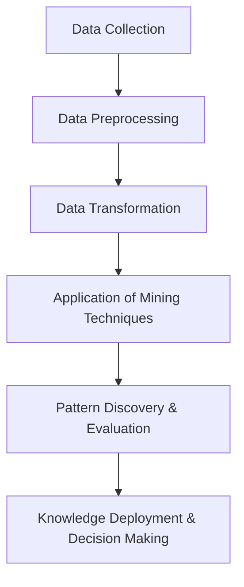

# Applications of Data Mining in Healthcare, Banking, and Retail

**Author:** Ayush Agrawal  
**Date:** October 2025  
**Course:** Data Warehousing and Data Mining  
**Activity:** Stage 1 – Self-Learning Assessment (MOOC)  

---

## Introduction

Data mining is the process of discovering patterns, correlations, and insights from large datasets using statistical, machine learning, and computational techniques. In today’s data-driven world, organizations in healthcare, banking, and retail rely heavily on data mining to make informed decisions, improve services, and gain a competitive edge.  

This article explores the **applications, methodologies, and importance** of data mining across these three key sectors, highlighting how it enhances operational efficiency, customer satisfaction, and strategic decision-making.

---

## Core Concepts of Data Mining

1. **Classification:** Assigning items in a dataset to predefined categories based on attributes.  
2. **Clustering:** Grouping similar items together without predefined labels.  
3. **Association Rule Mining:** Discovering relationships between variables, e.g., market basket analysis.  
4. **Anomaly Detection:** Identifying unusual or suspicious patterns in data.  
5. **Regression Analysis:** Predicting numerical outcomes based on historical data.  

---

## Data Mining in Healthcare

Data mining helps healthcare providers analyze patient records, improve diagnoses, and optimize treatments.  

**Key Applications:**
- **Predictive Analytics:** Identifying patients at risk of chronic diseases using historical data.  
- **Medical Imaging Analysis:** Detecting anomalies in X-rays, MRIs, or CT scans using pattern recognition.  
- **Hospital Resource Management:** Forecasting patient admissions and optimizing staff allocation.  
- **Drug Discovery:** Analyzing chemical and clinical data to accelerate the development of new medications.  

**Benefits:**
- Enhanced patient care through evidence-based decision-making.  
- Reduced healthcare costs by preventing unnecessary procedures.  
- Improved operational efficiency in hospital management.

---

## Data Mining in Banking

Banks generate massive amounts of transactional and customer data daily. Data mining is used to detect fraud, evaluate credit risk, and personalize financial services.

**Key Applications:**
- **Fraud Detection:** Identifying suspicious transactions using anomaly detection algorithms.  
- **Customer Segmentation:** Grouping clients based on spending behavior for targeted marketing.  
- **Credit Scoring:** Predicting the likelihood of loan repayment based on historical data.  
- **Churn Prediction:** Recognizing customers at risk of leaving the bank and designing retention strategies.  

**Benefits:**
- Increased security and reduced financial losses.  
- Better customer insights and personalized offerings.  
- Informed decision-making for risk management and regulatory compliance.

---

## Data Mining in Retail

Retail businesses leverage data mining to understand customer behavior, optimize inventory, and maximize sales.  

**Key Applications:**
- **Market Basket Analysis:** Discovering product associations to improve cross-selling and promotions.  
- **Sales Forecasting:** Predicting future demand for products using historical sales data.  
- **Customer Sentiment Analysis:** Analyzing reviews and feedback to enhance products and services.  
- **Inventory Optimization:** Managing stock levels efficiently to reduce overstocking or stockouts.  

**Benefits:**
- Improved marketing effectiveness and customer satisfaction.  
- Optimized supply chain and inventory management.  
- Increased revenue through data-driven decisions.

---

## Data Mining Workflow Diagram

**Explanation:**  
1. **Data Collection:** Gathering structured and unstructured data from multiple sources.  
2. **Preprocessing:** Cleaning, handling missing values, and normalizing data.  
3. **Transformation:** Converting data into suitable formats for mining.  
4. **Mining Techniques:** Applying classification, clustering, association, or regression algorithms.  
5. **Pattern Discovery:** Identifying actionable insights and validating them.  
6. **Deployment:** Using insights for decision-making, process improvement, and strategy formulation.

---

## Importance in Computer Science and IT

- **Efficiency:** Automates the analysis of massive datasets, reducing human effort.  
- **Informed Decision-Making:** Supports strategic, evidence-based business choices.  
- **Innovation:** Enables new product development, personalized services, and predictive analytics.  
- **Integration with IT Systems:** Works with data warehouses, big data platforms, and business intelligence tools.  
- **Competitive Advantage:** Helps organizations stay ahead by leveraging data insights effectively.

---

## Challenges

- Data quality issues, missing or inconsistent data.  
- Privacy and ethical concerns, especially in healthcare and banking.  
- High computational requirements for large datasets.  
- Need for skilled professionals to design and interpret data mining models.  

---

## Conclusion

Data mining is an essential technology for extracting valuable insights from large datasets. Its applications in healthcare, banking, and retail demonstrate its power to enhance operational efficiency, improve customer experience, and support strategic decision-making.  

As data continues to grow in volume and complexity, data mining will remain a critical tool in computer science and the IT industry. Organizations that effectively leverage data mining gain a significant advantage in innovation, risk management, and service quality.

---

## References

- Han, Jiawei, Kamber, Micheline, Pei, Jian. *Data Mining: Concepts and Techniques*, 3rd Edition.  
- Tan, Steinbach, Kumar. *Introduction to Data Mining*.  
- Witten, Frank, Hall. *Data Mining: Practical Machine Learning Tools and Techniques*.  
- Online resources: GeeksforGeeks, TutorialsPoint – Data Mining Applications.

---

*Created as part of Stage 1 – Self-Learning Assessment (MOOC) for Data Warehousing and Data Mining.*
