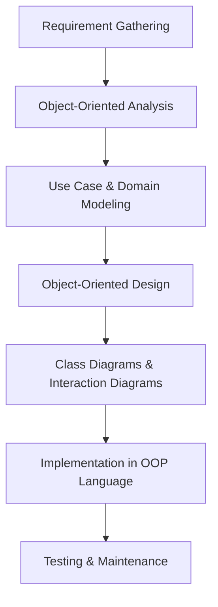

# Object-Oriented Analysis and Design (OOAD)

**Author:** Ayush Agrawal  
**Date:** October 2025  
**Course:** Software Engineering & Project Management  
**Activity:** Stage 1 – Concept Exploration through Article Writing  

---

## Introduction

Object-Oriented Analysis and Design (OOAD) is a cornerstone of modern software engineering. It is a methodology that combines the principles of object-oriented programming with system analysis and design to build software systems that are modular, reusable, and maintainable. OOAD provides a structured approach to analyzing a problem domain, designing solutions, and implementing them in object-oriented programming languages like Java, C++, and Python.

In software engineering, OOAD bridges the gap between **problem analysis** and **solution implementation**, ensuring that software is designed in a way that aligns with real-world entities and processes. In the IT industry, OOAD is widely used for building scalable enterprise applications, web services, and complex software systems.

---

## Key Concepts of OOAD

### 1. Objects and Classes
- **Objects:** Instances of entities that encapsulate data (attributes) and behavior (methods).  
- **Classes:** Blueprints for creating objects. Classes define attributes, behaviors, and relationships.

### 2. Encapsulation
Encapsulation is the principle of bundling data and methods together within a class. It ensures that the internal representation of an object is hidden from the outside world, providing controlled access through interfaces.

### 3. Inheritance
Inheritance allows a class (child) to inherit properties and methods from another class (parent), promoting code reuse and hierarchical modeling of real-world relationships.

### 4. Polymorphism
Polymorphism enables objects to take multiple forms. Methods can be overridden or overloaded to exhibit different behaviors depending on the context, enhancing flexibility and extensibility.

### 5. Abstraction
Abstraction focuses on exposing only relevant features and hiding unnecessary details. It simplifies complex systems by modeling them at a higher conceptual level.

---

## OOAD Process Overview

OOAD involves two major phases: **Object-Oriented Analysis (OOA)** and **Object-Oriented Design (OOD)**.

### 1. Object-Oriented Analysis (OOA)
- Identify real-world entities and model them as objects.  
- Define the relationships and interactions between objects.  
- Use **Use Case Diagrams** to capture functional requirements.  

### 2. Object-Oriented Design (OOD)
- Convert analysis models into detailed design models.  
- Define class diagrams, sequence diagrams, and interaction diagrams.  
- Focus on architecture, interfaces, and implementation constraints.

---

## OOAD Workflow Diagram

**Explanation:**  
- The workflow starts with understanding system requirements.  
- Analysis identifies objects and relationships.  
- Design translates the analysis into UML diagrams and architecture.  
- Implementation and testing complete the software development lifecycle.

---

## Real-Life Applications of OOAD

1. **Enterprise Resource Planning (ERP) Systems**  
   OOAD helps in modeling complex business processes as interacting objects, enabling modular and scalable ERP applications.

2. **Banking and Financial Software**  
   Accounts, transactions, customers, and loans can be modeled as objects with specific behaviors and relationships.

3. **E-commerce Platforms**  
   Products, orders, shopping carts, and payment gateways are modeled using OOAD principles for maintainability and reuse.

4. **Gaming Applications**  
   Characters, weapons, and environments are treated as objects, with polymorphism allowing dynamic interactions.

5. **Healthcare Management Systems**  
   Patient records, appointments, and billing systems benefit from OOAD’s modular and extensible design approach.

---

## Importance in Computer Science and IT Industry

- **Reusability:** OOAD promotes code and design reuse through classes and inheritance.  
- **Maintainability:** Modular design makes software easier to maintain, update, and scale.  
- **Scalability:** Object-oriented designs support large-scale applications with minimal coupling.  
- **Alignment with OOP Languages:** OOAD concepts directly map to object-oriented programming, streamlining development.  
- **Visualization:** UML diagrams provide clear representations of complex systems, aiding communication among developers and stakeholders.

---

## Advantages of OOAD

- Simplifies complex systems by modeling them as interacting objects.  
- Encourages modular, reusable, and extensible code.  
- Enhances communication among team members through visual modeling.  
- Supports rapid development and prototyping.  
- Reduces development time and costs by reusing existing components.

---

## Challenges and Considerations

- OOAD requires careful identification of objects and relationships; poor analysis can lead to flawed design.  
- Designing for extensibility and reusability requires experience and foresight.  
- Transitioning from analysis to design and implementation can be complex.  
- Overhead in managing large UML diagrams for very large systems.  

---

## Conclusion

Object-Oriented Analysis and Design is a foundational methodology in software engineering and project management. By modeling real-world entities as objects, OOAD enables developers to create modular, scalable, and maintainable software systems. Its principles of encapsulation, inheritance, polymorphism, and abstraction help in managing complexity while aligning closely with object-oriented programming languages.  

In the IT industry, OOAD is crucial for developing enterprise applications, web platforms, games, and large-scale systems. Proper application of OOAD improves software quality, reduces development time, and ensures alignment with business requirements, making it an indispensable practice in modern software development.

---

## References

- Sommerville, Ian. *Software Engineering*, 10th Edition.  
- Booch, Grady. *Object-Oriented Analysis and Design with Applications*.  
- UML 2.5 Specification, Object Management Group (OMG).  
- Pressman, Roger S. *Software Engineering: A Practitioner’s Approach*.  
- Larman, Craig. *Applying UML and Patterns: An Introduction to Object-Oriented Analysis and Design*.  

---

*Created as part of Stage 1 – Concept Exploration through Article Writing for Software Engineering & Project Management.*
