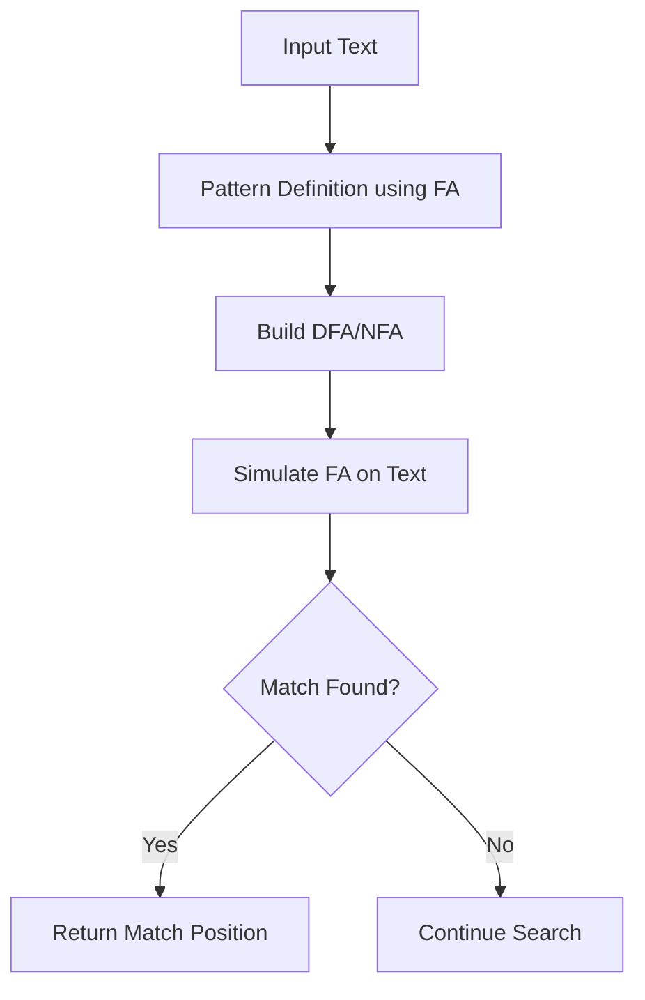

# Applications of Finite Automata in Text Search and Pattern Matching

**Author:** Ayush Agrawal  
**Date:** October 2025  
**Course:** Discrete Structure and Graph Theory  
**Activity:** Stage 1 – Concept Exploration through Article Writing  

---

## Introduction

Finite Automata (FA) are fundamental concepts in **Discrete Structures and Graph Theory** and play a crucial role in computer science. They are mathematical models of computation that represent a system with a finite number of states and transitions based on input symbols.  

One of the most common applications of Finite Automata is in **text search and pattern matching**, which forms the backbone of search engines, text editors, compilers, and string processing tools. This article explores the concepts of finite automata, their applications in pattern recognition, and their significance in computer science and the IT industry.

---

## Core Concepts of Finite Automata

### 1. Deterministic Finite Automata (DFA)
- A DFA consists of a finite set of states, a start state, an input alphabet, transition functions, and a set of accepting states.  
- For every state and input symbol, there is exactly one next state.  
- DFAs are widely used in lexical analysis for programming languages.

### 2. Non-Deterministic Finite Automata (NFA)
- In an NFA, multiple transitions for the same input or epsilon (ε) transitions are allowed.  
- NFAs are equivalent to DFAs in computational power but can be more compact in representation.  

### 3. Transition Diagrams
- States are represented as nodes, and transitions as directed edges labeled with input symbols.  
- Accepting states are usually denoted with double circles.  

---

## Workflow of Finite Automata in Text Search

**Explanation:**  
1. Define the pattern to be searched as a finite automaton.  
2. Convert the pattern into a DFA or NFA.  
3. Simulate the automaton on the input text.  
4. Identify and return positions where the pattern matches.  

---

## Real-Life Applications

1. **Text Editors:**  
   FA is used in “Find” or “Replace” functions to locate patterns efficiently in large documents.

2. **Search Engines:**  
   Web search algorithms utilize finite automata to match queries against indexed web pages.

3. **Compilers:**  
   Lexical analyzers use DFAs to tokenize input code during compilation.

4. **Spam Filters:**  
   Pattern matching using FA helps detect spam keywords in emails.

5. **Bioinformatics:**  
   DNA sequence matching and protein motif detection leverage finite automata algorithms for efficient pattern recognition.

---

## Importance in Computer Science and IT

- **Efficiency:** FA allows linear-time pattern matching, which is crucial for real-time applications.  
- **Formal Modeling:** Provides a rigorous method to model computational processes.  
- **Compiler Design:** Core to lexical analysis and syntax checking.  
- **Algorithm Foundation:** Basis for advanced topics like regular expressions, pushdown automata, and Turing machines.  
- **Versatility:** Used in NLP, network intrusion detection, and bioinformatics.

---

## Advantages of Using Finite Automata

- Fast and predictable performance in pattern matching.  
- Clear visual representation using state diagrams.  
- Easy to implement in software and hardware.  
- Forms the foundation for more complex automata and algorithms.  

---

## Challenges

- DFA can have a large number of states for complex patterns (state explosion problem).  
- NFAs may require conversion to DFA for deterministic execution, increasing space complexity.  
- Requires careful design to optimize transitions and memory usage.

---

## Conclusion

Finite Automata are simple yet powerful computational models with far-reaching applications in text search, pattern matching, and beyond. Understanding DFA and NFA concepts is essential for computer scientists and IT professionals involved in compiler design, search algorithms, and data analysis. Their efficiency, formal structure, and wide applicability make them indispensable tools in both academic and industrial domains.

---

## References

- Hopcroft, John E., Motwani, Rajeev, Ullman, Jeffrey D. *Introduction to Automata Theory, Languages, and Computation*, 3rd Edition.  
- Sipser, Michael. *Introduction to the Theory of Computation*.  
- Aho, Alfred V., Lam, Monica S., Sethi, Ravi, Ullman, Jeffrey D. *Compilers: Principles, Techniques, and Tools*.  
- Cormen, Thomas H., et al. *Introduction to Algorithms*, 4th Edition.  
- Online resources: GeeksforGeeks, TutorialsPoint – Finite Automata in Pattern Matching.

---

*Created as part of Stage 1 – Concept Exploration through Article Writing for Discrete Structure and Graph Theory.*
